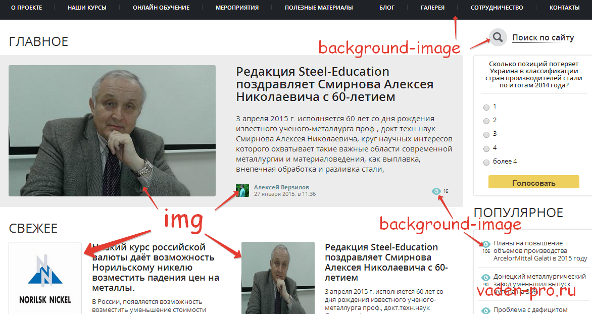

### about

* https://ru.hexlet.io/courses/css-content/lessons/media/theory_unit
* https://html5book.ru/images-in-html/
* https://webref.ru/layout/learn-html-css/adding-media
* :heavy_exclamation_mark: https://seranking.com/ru/blog/kak-optimizirovat-izobrazhenija-dlia-saita/

### про размеры  
https://doka.guide/html/img/#width-i-height  

Без задания размеров изображения рисунок отображается на странице в реальном размере.
Важно определить размер изображения, чтобы сказать браузеру, насколько большой должна быть картинка до загрузки 
страницы. Таким образом браузер может зарезервировать место для изображения и отображать страницы быстрее. 

Есть несколько разных способов задать размер изображений, которые хорошо работают на странице. 

Одним из способов является использование атрибутов width и height непосредственно в теге `` в HTML.
При этом сами единицы измерения px указывать не нужно, браузер поймёт.
Вы можете спросить: зачем так, ведь стиль нужно задавать с помощью CSS?
Это нужно, чтобы избежать прыжков контента при загрузке страницы. 
Частая ситуация, когда картинка очень тяжёлая, а скорость интернета пользователя невысокая.
Если размеры не заданы в атрибутах, то `` займёт место как строка текста.
После загрузки картинка встанет на страницу, подвинув остальной контент. Пользователей обычно очень раздражают такие скачки. Они теряют место, где читали, а браузеру приходится перерисовывать страницу заново.

Кроме того, для указания размеров изображения могут быть использованы свойства width и height в CSS. 
Когда одновременно применяются свойства CSS и атрибуты HTML, то свойства CSS будут иметь приоритет над атрибутами HTML.

Указание только ширины или высоты настроит другой размер автоматически, чтобы сохранить пропорции изображения. 
В качестве примера, если мы хотим, чтобы изображение было 200 пикселей в высоту, 
но ширина нас не особо беспокоит, то мы можем установить height как 200 пикселей, 
а ширина изображения подстроится соответственно. Одновременная установка width и height также будет работать, 
однако это может нарушить пропорции изображения, в результате чего появятся искажения.

### img или background-image?

* https://htmlacademy.ru/blog/html/content-or-decor-img
* https://vaden-pro.ru/blog/css/background-image-ili-img

вспоминаем основное назначение html (смысл, структура) и css (декоративное)  
соответственно есть *контентные* и *декоративные* изображения

Различие состоит в том, что картинки несущие смысловую нагрузку или же каким-либо образом относящиеся 
к содержанию страницы следует вставлять тегом img (картинки в тексте, баннеры, картинки слайдера, аватарки и тд).
Все остальное (просто элементы оформления: различного рода разделители, маркеры, фоны и тд.) 
следует вставлять в дизайн используя background-image.

